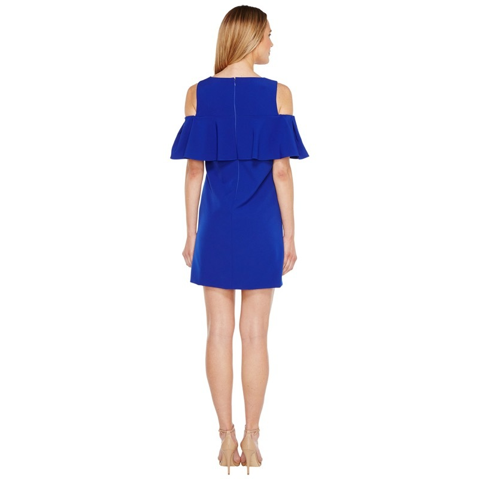
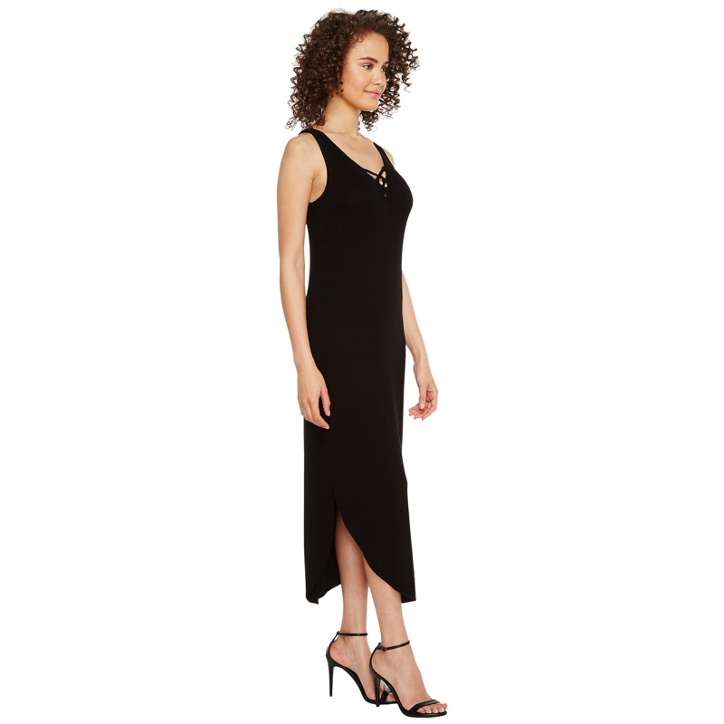
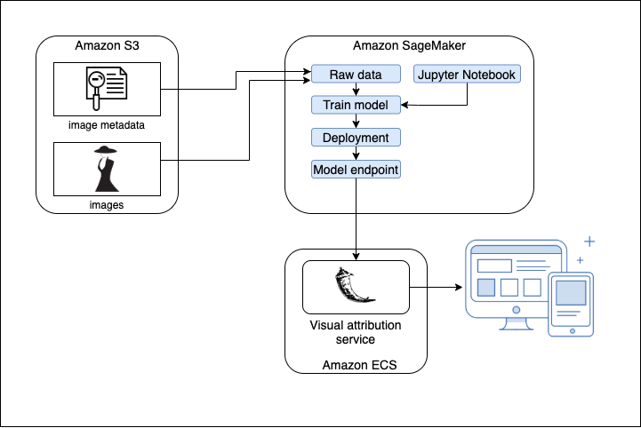
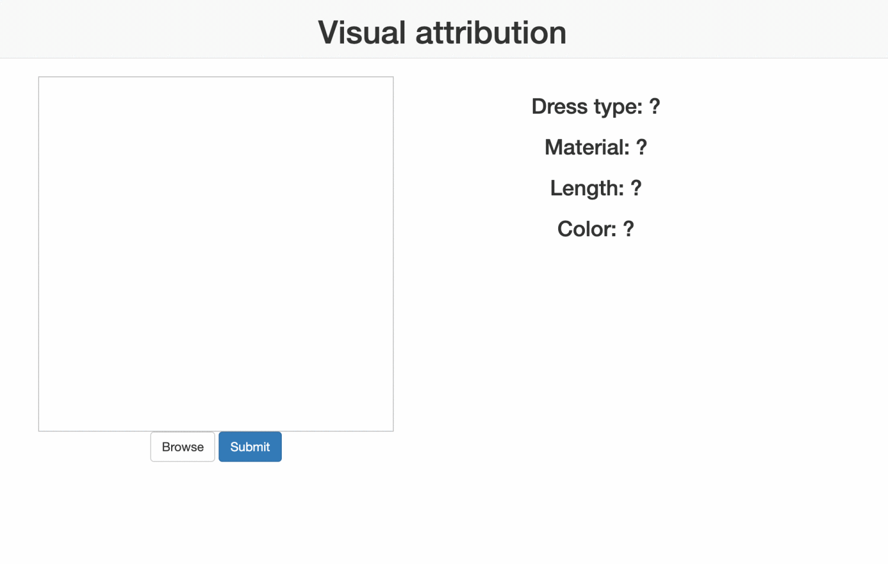

# Visual Attribution
## Task
Visual attribution is the problem of identifying object features using its photo.
This problem is very important as it is often used as part of a solution for a wide range of tasks. 
Among these tasks can be:

* Making a well-attributed catalog which will give users the ability to filter product specifying their characteristics.
* Making recommendations showing similar products.
* Making visual search allowing to find products by images.

In this showcase, we will show what is a visual attribution solving this problem for women dresses. 
At the end of the path, you could upload an image with a dress and get a prediction for such attributes as length and color.
## Data
To train the model you need data. You can use this
[data](https://storage.googleapis.com/dell-ml-datasets/visual-attribution/data.tar.gz)
which holds on Google Cloud Storage and is publicly available.

<table>
  <tr>
    <td></td>
    <td></td>
    <td></td>
    <td></td>
  </tr>
</table>

## Environment
AWS
* SageMaker
* S3 buckets to store data
* ECS to deploy backend service with UI

## Backend-UI

